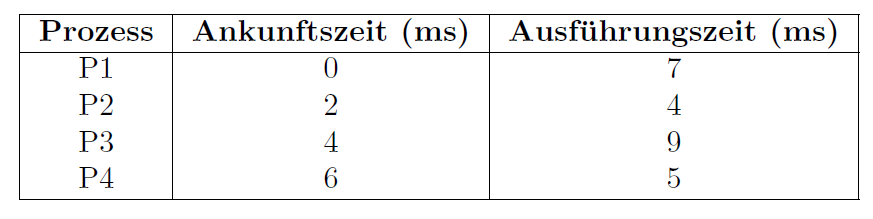
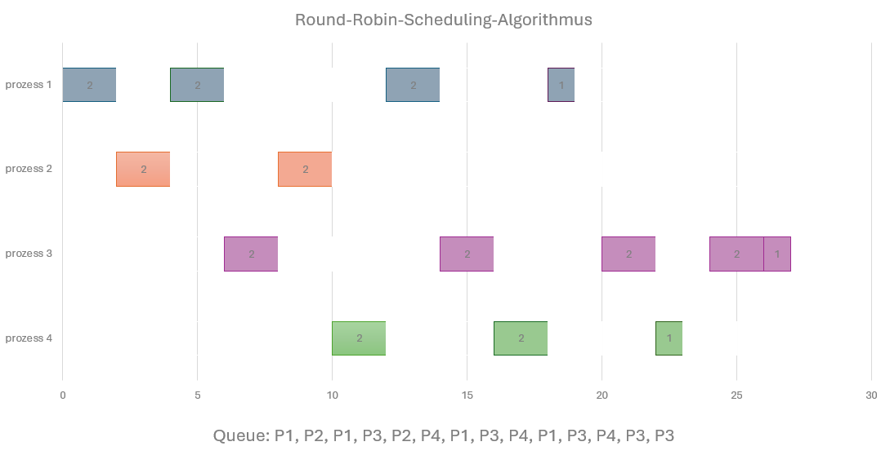

## Aufgabe 2: Round-Robin-Scheduling-Algorithmus durchspielen

In dieser Aufgabe sollen Sie den Round-Robin-Scheduling-Algorithmus anhand eines Beispiels auf Papier
durchspielen. Ziel ist es, ein besseres Verständnis für die Funktionsweise von präemptivem Scheduling zu
erlangen. Verwenden Sie die folgenden Prozesse und 2ms als Zeitscheibe für den Round-Robin-Scheduling-
Algorithmus:

### 1. Erstellen Sie ein Gantt-Diagramm:
Erstellen Sie ein Gantt-Diagramm, das die Ausführung der Prozesse im Zeitverlauf darstellt. Berücksichtigen
Sie dabei die Zeitscheibe von 2 ms sowie die Ankunftszeiten der Prozesse. Gehen Sie davon aus, dass neue Prozesse, die genau am Ende einer Zeitscheibe eintreffen, bevorzugt in die Ready-Queue aufgenommen
werden.

### 2. Berechnen Sie die durchschnittliche Wartezeit und Durchlaufzeit:

Berechnen Sie die durchschnittlliche Wartezeit und Durchlaufzeit der Prozessausführung. Die Wartezeit
beschreibt die Zeitspanne, die ein Prozess im Wartezustand verbringt, bevor er zur Ausführung gelangt.
Die Durchlaufzeit hingegen bezeichnet die gesamte Zeitspanne vom Eintreffen eines Prozesses im System
bis zu seiner vollständigen Ausführung.

Durchlaufzeit = Fertigstellungszeit - Ankunftszeit

### Durchlaufzeit
___

Für jeden Prozess \( P_i \) gilt :
$$
Duchlaufzeit_i = {\text{Fertigstellungszeit}}_i - {\text{Ankunftszeit}}_i
$$

Durchlaufzeit von P1  = 19 - 0 = 19*ms*

Durchlaufzeit von P2 = 10 - 2 = 8*ms*

Durchlaufzeit von P3 = 25 - 4 = 21*ms*

Durchlaufzeit von P4 = 22 - 6 = 16*ms*

### Wartezeit
___
Für jeden Prozess \( P_i \) gilt:
$$
Wartezeit_i = Durchlaufzeit_i - {\text{Ausführungszeit}}_i
$$

Wartezeit von P1  = 19 - 7 = 12*ms*

Wartezeit von P2 = 8 - 4 = 4*ms*

Wartezeit von P3 = 21 - 9 = 12*ms*

Wartezeit von P4 = 16 - 5 = 11*ms*

**Durchschnittliche Wartezeit**:

(12*ms* + 4*ms* + 12*ms* + 11*ms*) / 4 = 39*ms* / 4 = 9,75*ms*

